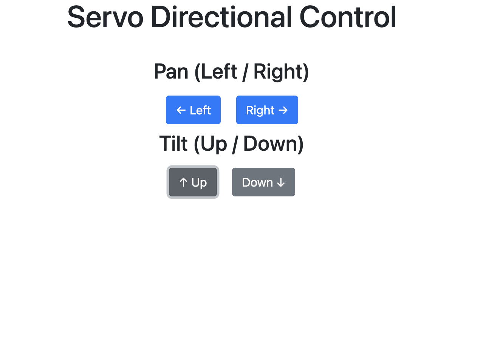

# 📷 Raspberry Pi Pan-Tilt Live Streamer & Controller

A Flask-based web application providing real-time camera streaming with multi-axis Pan-Tilt servo motor control via Raspberry Pi GPIO.

---

## 🖥️ Web Interface Preview



---

## ✨ Features

- **Remote Servo Control:** Control Pan (Left/Right) and Tilt (Up/Down) camera orientation via web buttons.
- **Flask REST Endpoints:** Asynchronous HTTP/Fetch requests triggering hardware GPIO pins.
- **MJPEG Live Streaming:** Multi-threaded camera frame capture designed for Raspberry Pi Camera Module.

---

## 📁 Project Architecture

```text
├── app.py                  # Main Flask application & routes
├── templates/
│   ├── controller.html     # Remote control web dashboard
│
└── server/
    ├── appCam.py           # Camera stream controller
    ├── camera_pi.py        # Frame capturing logic
    └── angleServoCtrl.py   # PWM duty cycle calculations
    └── index.html          # Web view template
```
